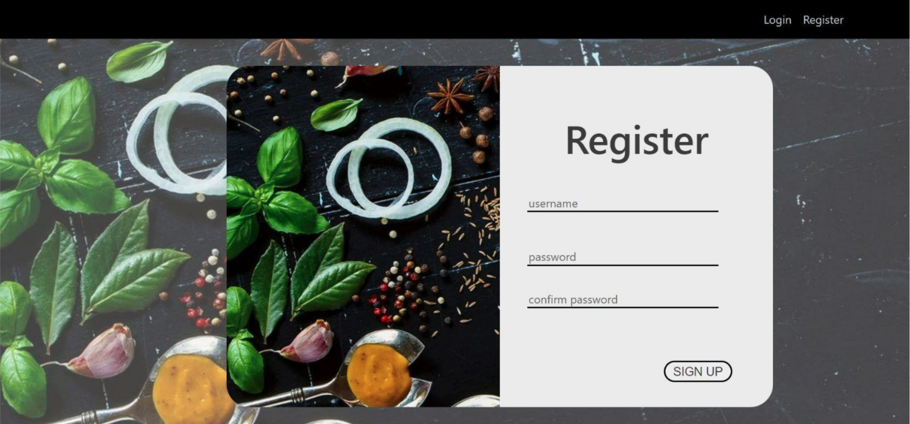
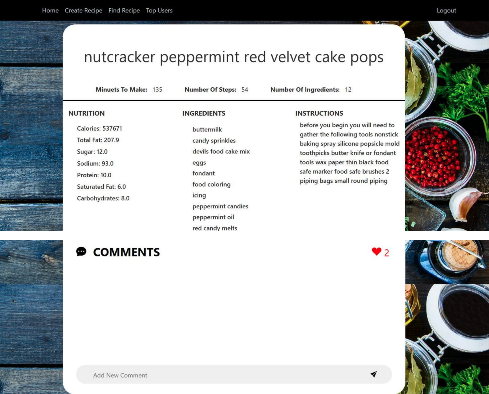

# CookingMadeSocial

Welcome to CookingMadeSocial, a dynamic social network devoted to the sharing and appraisal of recipes. Our primary objective is to establish a platform that empowers individuals to exchange their culinary innovations and perspectives on cooking and baking. With an extensive repository of recipes, our website offers visitors a broad spectrum of options that they can tailor to their personal preferences.

CookingMadeSocial was conceived as a project submission for a university database workshop course. Leveraging Flask Blueprint, we've architected the application to ensure modularity and scalability. The dataset utilized in this project was sourced from Kaggle, ensuring a diverse and comprehensive assortment of recipes, while back-end functionality and database management have been implemented using MySQL Server.

##

  

  

  

  

## Collaborators

Developed by Bar Tawil and another participant in the workshop.
